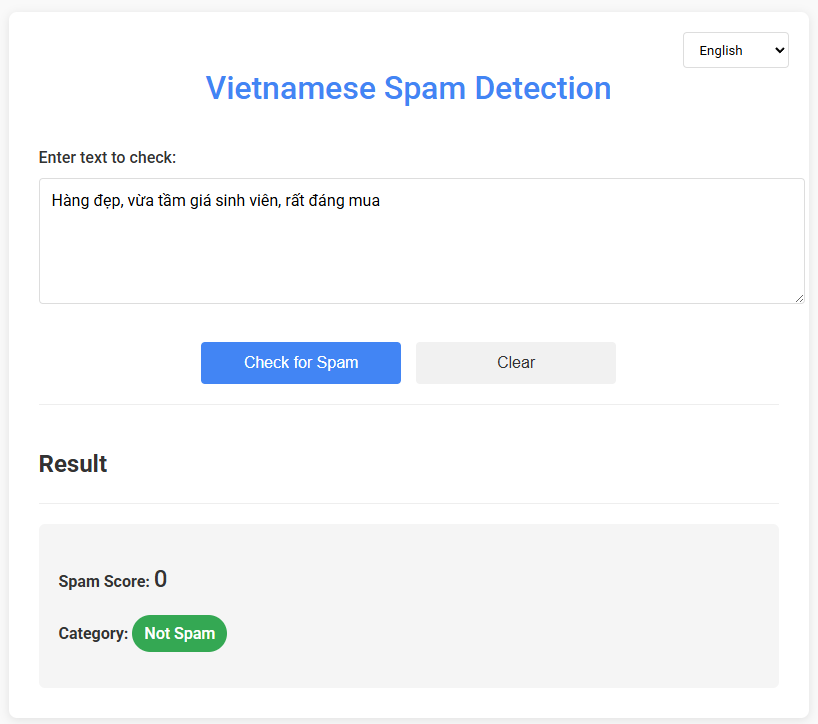
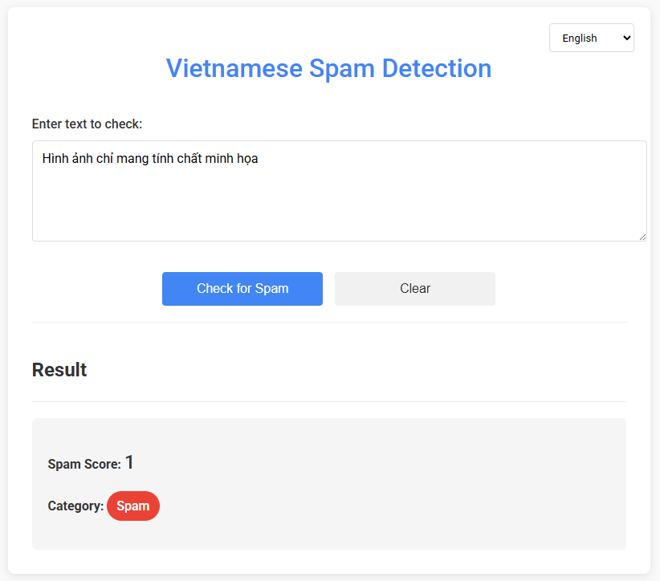

# Vietnamese-spam-detection-model

## Overview
This repo contains only files that provide a simple web form for checking spam using a machine learning model API deployed at Hugging - Gradio Space.

This model is a small part of a bigger project, which is in this [repo](https://github.com/HarryLee02/Reputation_Rating_with_Spam_Detection_for_Ecommerce_using_Blockchain_Network_and_Deep_Learning.git).


The model itself is in another repo on [huggingface.co/HarryLee02](https://huggingface.co/spaces/HarryLee02/Vietnamese-spam-detection/tree/main)

Live website is hosted at [https://vietnamese-spam-detection-model.vercel.app/](https://vietnamese-spam-detection-model.vercel.app/), but due to the fact that Hugging Face will turn off unactive models  around every 24 hours, I recommend using the Hugging Face link.

**Demo no spam detected**



**Demo spam detected**



## Features

The website contains minimal features since I only want to deploy my model. However, I was generous enough to add these:
- **Detection**: This is the main purpose of the model, it takes `Vietnamese` input and return output
- **Language**: A dropdown menu to change between English - Vietnamese

## Model parameters

*Will be updated later...*

## How does it work
- The form sends user input to a backend API route (`/api/predict`) via AJAX.
- The backend API route uses the `@gradio/client` package to connect to Gradio Space and return the results.
- The frontend displays the spam score and category returned by the model.

## Project Structure
```
📦 Vietnamese-spam-detection-model
├── 📁 assets
├── 📁 api
│   └── 📄 predict.js
├── 📄 .dockerignore
├── 📄 .gitignore
├── 📄 app.js
├── 📄 compose.yaml
├── 📄 Dockerfile
├── 📄 favicon.ico
├── 📄 index.html
├── 📄 package.json
├── 📄 package-lock.json
├── 📄 README.md
```
`api/predict.js`: Vercel/Next.js API route for backend inference.

`index.html`: The frontend form.

`app.js`: Optional Express server for local development.

`package.json`: Project dependencies.

## Backend API Route Example (Vercel/Next.js)
`api/predict.js`:
```js
import { Client } from "@gradio/client";

export default async function handler(req, res) {
  if (req.method !== 'POST') {
    return res.status(405).json({ error: 'Method not allowed' });
  }
  const { input } = req.body;
  if (!input) {
    return res.status(400).json({ error: 'Missing input' });
  }
  try {
    const client = await Client.connect("HarryLee02/Vietnamese-spam-detection"); 
    // Replace with your actual Space URL if you also want to train and host your own model.
    const result = await client.predict("/predict", [input]);
    res.status(200).json(result.data);
  } catch (err) {
    res.status(500).json({ error: err.message });
  }
}
```


## Deploying
### Local
First, clone this repo:

```bash
git clone https://github.com/HarryLee02/Vietnamese-spam-detection-model.git 
```

Run the command below to install dependencies and the server is up at http://localhost:3000
```bash
npm install
node app.js
```
### Vercel
Click this:

[](https://vercel.com/new/clone?repository-url=https%3A%2F%2Fgithub.com%2FHarryLee02%2FVietnamese-spam-detection-model.git)

or follow the steps below:

1. Clone this GitHub repo.
2. Connect the repo to Vercel (https://vercel.com/import).
3. Vercel will auto-detect the API route in `api/predict.js` and serve `index.html` as a static file.
4. Make sure to update the Gradio Space URL in `api/predict.js` if you are using your own model.

### Docker
I dockerized this app but have not tested it properly so feel free to open an issue if something goes wrong.

After cloning this repo, make sure you also downloaded Docker. To verify, check the version:
```bash
docker --version
# Docker version 27.3.1, build ce12230
```
Use this one-liner to build and start the dockerfile
```bash
docker compose up --build
```

If run correctly, the app will be up at http://localhost:3000

## Citation

*Van Dinh, Co, and Son T. Luu*. ‘**Metadata Integration for Spam Reviews Detection on Vietnamese E-Commerce Websites**’. International Journal of Asian Language Processing, vol. 34, no. 01, World Scientific Pub Co Pte Ltd, Mar. 2024.

[](https://doi.org/10.1142/s2717554524500024)
